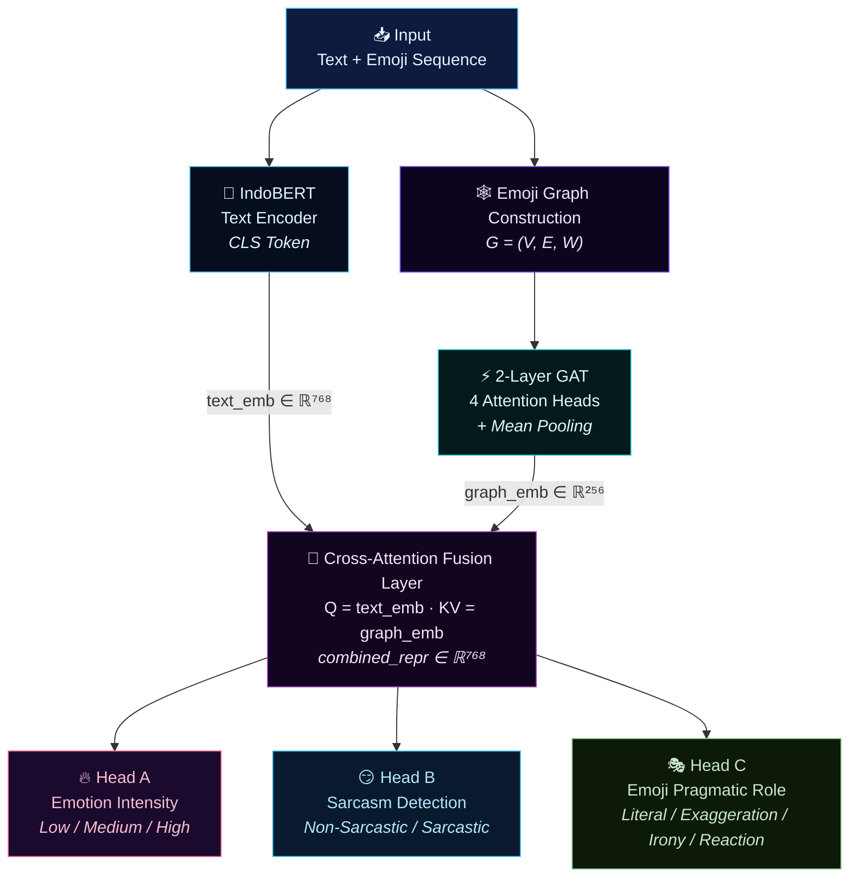

# Modeling Emoji as Pragmatic Signals in Social Media Text Using a Hybrid Transformer–Graph Neural Network Architecture

## EPGT: Emoji-aware Graph Neural Network + Transformer for Hate Speech Detection

<p align="center">
  
  
  
  
</p>

---

## 📌 Project Overview

**EPGT** (*Emoji Pragmatic Graph Transformer*) is a research project investigating the role of emoji as pragmatic signals in social media hate speech detection. Rather than treating emoji as flat tokens appended to text, EPGT constructs an **emoji interaction graph** that captures co-occurrence patterns, positional relationships, and semantic similarity between emoji — then fuses this structural signal with contextual text representations via a cross-attention mechanism.

The model addresses a core limitation in existing hate speech detection systems: **the systematic underutilization of emoji as carriers of pragmatic meaning**. By jointly modeling textual semantics and emoji graph structure, EPGT aims to improve detection of sarcasm-mediated hate speech, irony, and other forms of implicit hostility that conventional text-only classifiers frequently misclassify.

---

## 🔍 Research Motivation

Most state-of-the-art hate speech detection systems operate exclusively on textual input, treating emoji either as noise to be removed or as ordinary tokens in a vocabulary. This design choice introduces a critical blind spot: **emoji routinely invert, intensify, or disambiguate the pragmatic intent of an utterance**.

Consider the following examples:

| Utterance | Surface Sentiment | Pragmatic Intent |
|---|---|---|
| `"Nice job 🤡"` | Positive (textual) | Sarcastic / Demeaning |
| `"Sure, totally fine 🙂"` | Neutral (textual) | Passive-aggressive |
| `"You're so smart 💀💀"` | Positive (textual) | Mocking / Ironic |
| `"Great idea 👍🗿"` | Positive (textual) | Dismissive sarcasm |

In each case, a text-only classifier operating on the lexical surface would likely produce an incorrect prediction. The emoji sequence — particularly when repeated or co-occurring in specific patterns — encodes the true communicative intent. EPGT is designed to capture precisely this layer of meaning.

This problem is especially pronounced in **Indonesian social media**, where informal registers, code-switching, and culturally-specific emoji usage create additional challenges for multilingual models trained primarily on English data.

---

## 🧠 Proposed Method: EPGT

EPGT integrates three principal components into a unified multi-task learning framework:

### Component 1 — Transformer Text Encoder
A pre-trained **IndoBERT** (`indobenchmark/indobert-base-p1`) encoder processes the cleaned input text. The CLS token representation is used as the sentence-level text embedding:

```
text_embedding ∈ ℝ⁷⁶⁸
```

### Component 2 — Emoji Graph Neural Network
For each input, an **emoji interaction graph** G = (V, E, W) is constructed:
- **Nodes** V: each unique emoji is a node with a 203-dimensional feature vector composed of a 200-dim semantic embedding, a normalized positional scalar, a sentiment polarity scalar, and a repetition flag
- **Edges** E: three types — Sequential (adjacent emoji), Repetition (same emoji within window K=3), Semantic (cosine similarity ≥ 0.7)
- **Edge weights** W: encode proximity, frequency, and semantic similarity

The graph is processed by a **2-layer Graph Attention Network (GAT)** with 4 attention heads and global mean pooling:

```
graph_embedding ∈ ℝ²⁵⁶
```

### Component 3 — Pragmatic Fusion Layer
A **cross-attention mechanism** fuses text and graph representations, with the text embedding as Query and the graph embedding (projected to ℝ⁷⁶⁸) as Key and Value. A residual connection preserves the original text signal:

```
Q = W_Q · text_emb   (ℝ⁷⁶⁸)
K = W_K · graph_emb  (ℝ²⁵⁶ → ℝ⁷⁶⁸)
V = W_V · graph_emb  (ℝ²⁵⁶ → ℝ⁷⁶⁸)

combined_repr = LayerNorm(text_emb + Attention(Q, K, V)) ∈ ℝ⁷⁶⁸
```

### Component 4 — Multi-Task Classification Head
Three parallel classification heads operate on `combined_repr`:

| Head | Task | Classes |
|---|---|---|
| Head A | Emotion Intensity | Low / Medium / High |
| Head B | Sarcasm Detection | Non-Sarcastic / Sarcastic |
| Head C | Emoji Pragmatic Role | Literal / Exaggeration / Irony / Reaction |

**MTL Loss:**
```
L_total = 0.40 · L_intensity + 0.35 · L_sarcasm + 0.25 · L_role
```

---

## 🏗️ Architecture



> 📊 Full architecture diagram: `outputs/figures/model_architecture.png`

---

## 🔬 Ablation Study Design

Five configurations are evaluated to quantify the contribution of each architectural component:

| Config | Description | Modification |
|---|---|---|
| ABL-1 | No Graph | Zero graph embedding (GAT bypassed) |
| ABL-2 | No Fusion | Concat instead of cross-attention |
| ABL-3 | No Emoji | Text-only (≡ IndoBERT baseline) |
| ABL-4 | No Position | Zero positional features in nodes |
| **ABL-5** | **Full EPGT** | **All components active (reference)** |

---

## 📂 Research Pipeline

The full pipeline is implemented across six Jupyter notebooks, designed to run sequentially on Google Colab:

| Notebook | Stage | Description |
|---|---|---|
| `NB01_data_collection.ipynb` | Data Collection | Multi-platform scraping (Twitter/X, Instagram, TikTok, YouTube) with emoji filtering |
| `NB02_annotation_management.ipynb` | Annotation | 3-layer annotation schema, IAA computation (Cohen's κ), majority vote aggregation |
| `NB03_preprocessing_emoji_graph.ipynb` | Preprocessing | 7-stage text normalization, IndoBERT tokenization, emoji graph construction |
| `NB04_model_architecture.ipynb` | Architecture | Implementation of all 4 EPGT components + ablation mode support |
| `NB05_training_pipeline.ipynb` | Training | AdamW + linear warmup, early stopping, MTL loss, baseline training (B1–B3) |
| `NB06_evaluation_ablation.ipynb` | Evaluation | Test set evaluation, classification reports, ablation table, error analysis |

---

## ⚙️ Experimental Setup

**Framework & Libraries**

| Component | Library / Version |
|---|---|
| Deep Learning | PyTorch ≥ 2.0 |
| Graph Neural Network | PyTorch Geometric |
| Pre-trained LM | HuggingFace Transformers ≥ 4.30 |
| Text Encoder | IndoBERT (`indobenchmark/indobert-base-p1`) |
| Emoji Processing | `emoji` library |

**Training Configuration**

| Hyperparameter | Value |
|---|---|
| Optimizer | AdamW |
| Learning Rate (BERT) | 2e-5 |
| Learning Rate (non-BERT) | 2e-4 |
| Weight Decay | 0.01 |
| Warmup Ratio | 10% |
| Max Epochs | 20 |
| Early Stopping Patience | 3 |
| Batch Size | 16 |
| Gradient Clip | max_norm = 1.0 |
| Dropout | 0.3 |

**Evaluation Metrics**

- Macro F1-score *(primary — handles class imbalance)*
- Weighted F1-score
- Accuracy
- Per-class Precision / Recall
- Aggregated `avg_macro_f1` across all three tasks *(used for model selection)*

---

## 📊 Preliminary Results

> ⚠️ **Important disclaimer:** The experiments reported below use a **mock dataset (80 samples)** generated for proof-of-concept validation. These results are intended to verify that the pipeline runs correctly and that architectural components interact as designed — **they do not constitute empirical claims**. Real-dataset collection and annotation are currently in progress.

**Validation Set — Proof of Concept (Mock Data)**

| Model | avg Macro F1 | F1-Intensity | F1-Sarcasm | F1-Role |
|---|---|---|---|---|
| B1: IndoBERT text-only | 0.529 | 0.611 | 0.455 | 0.522 |
| B2: Single-task (best) | 0.562 | — | 0.810 | — |
| B3: IndoBERT + flat emoji | 0.539 | 0.716 | 0.455 | 0.447 |
| **EPGT (Proposed)** | **0.676** | **0.716** | **0.810** | **0.503** |

**Ablation Study — Test Set (Mock Data)**

| Config | avg Macro F1 | ΔvsABL5 |
|---|---|---|
| ABL-1: No Graph | 0.382 | −0.029 |
| ABL-2: No Fusion | 0.358 | −0.053 |
| ABL-3: No Emoji | 0.416 | +0.004 |
| ABL-4: No Position | 0.358 | −0.053 |
| **ABL-5: Full EPGT** | **0.411** | ref |

**Key observations from proof-of-concept:**
- EPGT outperforms the text-only baseline (B1) by **+14.7pp** avg Macro F1
- The **Fusion Layer** (cross-attention) is the most critical component (ABL-2 shows largest performance drop)
- **Positional encoding** of emoji contributes as much as the fusion mechanism (ABL-4 ≈ ABL-2)
- The model correctly identifies sarcasm-carrying emoji patterns (e.g., `💀`, `🗿`, `🤡`) as discussed in the error analysis

---

## 🗂️ Repository Structure

```
epgt-multimodal-hate-speech-detection/
│
├── README.md
├── requirements.txt
├── .gitignore
├── LICENSE
│
├── notebooks/
│   ├── NB01_data_collection.ipynb
│   ├── NB02_annotation_management_dataset_split.ipynb
│   ├── NB03_preprocessing_emoji_graph.ipynb
│   ├── NB04_model_architecture.ipynb
│   ├── NB05_training_pipeline.ipynb
│   └── NB06_evaluation_ablation.ipynb
│
├── src/
│   ├── data/
│   │   ├── collector.py          # Multi-platform data collection
│   │   ├── annotator.py          # Heuristic annotation + IAA
│   │   ├── splitter.py           # Adaptive stratified split
│   │   ├── preprocessor.py       # 7-stage text normalization + tokenization
│   │   └── dataset.py            # PyTorch Dataset + DataLoader
│   │
│   ├── features/
│   │   └── emoji_graph.py        # Graph construction G=(V,E,W)
│   │
│   ├── models/
│   │   ├── text_encoder.py       # IndoBERT wrapper (Component 1)
│   │   ├── gat_encoder.py        # 2-layer GAT encoder (Component 2)
│   │   ├── fusion_layer.py       # Cross-attention fusion (Component 3)
│   │   ├── classification_head.py # MTL heads (Component 4)
│   │   └── epgt.py               # Full EPGT model assembly
│   │
│   ├── training/
│   │   ├── loss.py               # Weighted MTL CrossEntropy loss
│   │   ├── metrics.py            # Macro F1 + evaluation metrics
│   │   └── trainer.py            # Training loop + early stopping
│   │
│   └── evaluation/
│       └── evaluator.py          # Test set evaluator + reports
│
└── outputs/
    ├── figures/
    │   ├── training_curves.png
    │   ├── confusion_matrices.png
    │   ├── ablation_bar.png
    │   └── label_distribution.png
    └── tables/
        ├── evaluation_results.json
        ├── ablation_table.json
        └── model_architecture_summary.json
```

---

## 🚀 Installation

```bash
# Clone the repository
git clone https://github.com/f4tahitsYours/epgt-multimodal-hate-speech-detection.git
cd epgt-multimodal-hate-speech-detection

# Install dependencies
pip install -r requirements.txt
```

> **Note:** This project is designed to run on **Google Colab** with GPU acceleration (T4 or A100 recommended). Local execution requires a CUDA-enabled GPU with at least 8GB VRAM due to IndoBERT model size (~498MB).

---

## ▶️ How to Run

Run the notebooks **in sequential order**. Each notebook produces outputs consumed by the next stage.

```
NB01 → NB02 → NB03 → NB04 → NB05 → NB06
```

1. Open each notebook in **Google Colab**
2. Mount Google Drive when prompted
3. Set `DRIVE_ROOT` to your project directory path
4. Run all cells top-to-bottom

> ⚠️ NB01 requires social media API credentials. For proof-of-concept runs, a mock data generator is included as fallback.

---

## 🔖 Project Status

```
[✅] NB01 — Data Collection Pipeline        (complete)
[✅] NB02 — Annotation Management & Split   (complete)
[✅] NB03 — Preprocessing & Graph Build     (complete)
[✅] NB04 — Model Architecture              (complete)
[✅] NB05 — Training Pipeline               (complete)
[✅] NB06 — Evaluation & Ablation Study     (complete)
[🔄] Real Dataset Collection               (in progress)
[⏳] Empirical Validation                  (pending data)
[⏳] Paper Submission                      (pending)
```

**Current phase:** Proof-of-concept implementation is complete. Real annotated dataset collection is ongoing. Empirical results will be updated upon dataset completion.

---

## 🔭 Future Work

- **Larger dataset:** Scale to 50,000+ annotated samples across 4 platforms for statistically robust evaluation
- **Cross-platform analysis:** Investigate whether emoji pragmatic patterns differ systematically across Twitter/X, Instagram, TikTok, and YouTube
- **Multilingual extension:** Adapt the pipeline for cross-lingual hate speech detection (Indonesian + English code-switching)
- **Richer emoji semantics:** Replace random embeddings with pre-trained emoji2vec or CLIP-based visual embeddings
- **Dynamic graph construction:** Explore attention-based dynamic edge formation rather than rule-based edge types
- **Deployment:** Build a real-time inference API for social media content moderation

---

## 📄 License

This project is licensed under the CC BY-NC-ND — see the [LICENSE](LICENSE) file for details.

---

## 🙏 Acknowledgements

- [IndoBERT](https://huggingface.co/indobenchmark/indobert-base-p1) by IndoNLU Benchmark
- [PyTorch Geometric](https://pytorch-geometric.readthedocs.io/) for graph neural network primitives
- [HuggingFace Transformers](https://huggingface.co/docs/transformers) for pre-trained model infrastructure

---

<p align="center">
  <i>Research in progress — empirical results pending real dataset collection.</i><br>
  <i>Pipeline implementation complete as of 2025.</i>
</p>